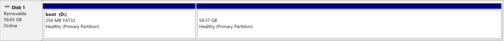
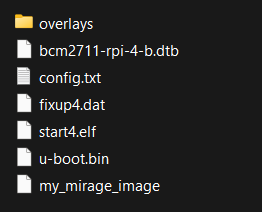

# Sel4 on Raspberry pi
The sel4 microkernel supports the following Raspberry Pi platforms:
- RPI 3B
- RPI 3B+
- RPI 4B (1GB, 2GB, 4GB, 8GB)

Additional details can be found at: https://docs.sel4.systems/Hardware/

Building and running a sel4 based system requires a number of steps, here we go through all the steps to see a sel4 system run on a RPI 4B 4GB, similiar if not identical steps are done on other RPI platforms.

## Building
sel4/Microkit need to know certain information about the target platform at compile time (e.g. memory size), as such when building sel4 based images (programs to run on your RPI), you need to select the correct platform or platform settings.

If you are building the sel4 microkernel itself, the minimal arguments are below, as seen in this sel4Test build step for a RPI4B 4GB:
```bash
../init-build.sh -DPLATFORM=rpi4 -DAARCH64=1 -DRPI4_MEMORY=4096
```

If you are building Microkit based projects, Microkit leaves the build system entirely to the user, so you will need to read the project build instructions, but common convention will have your build arguments look like this:
```bash
make BUILD_DIR=build MICROKIT_BOARD=rpi4b_4gb MICROKIT_CONFIG=debug MICROKIT_SDK=./../microkit-sdk-2.0.1
```
Note that you only need to select the correct MICROKIT_BOARD, Microkit builds sel4 for you with appropriate settings.
The result of building a Microkit system should be an image (.img) file, which can be used below.

## Filesystem
Once you have built the image(s) you want to run, you will need to setup the correct files on a SD card, which the RPI will use to boot.

Starting with an empty SD card, you will need to create a FAT32 boot partition, this partition is where the RPI firmware will search for a boot-config, a bootloader, device tree files, etc.
<br>
If you want Linux (if its running as a VM in your sel4 system) to access storage on the SD card, you will need to add another partition
with a compatible format like ext4.



Next, the boot partion needs to contain a few specific files, namely:
- Basic firmware
- A bootloader
- RPI device tree
- Overlays
- Boot config
- sel4/Mirage images

A ready minimum-set of these files is available in the '/sd-files' folder, you can copy them into the SD card and skip to the 'sel4/Mirage Images' subsection, but I recommend getting them manually (e.g. to get newest versions):

### Basic Firmware
Two firmware files are required, found [here](https://github.com/raspberrypi/firmware/blob/master/boot/start4.elf) and [here](https://github.com/raspberrypi/firmware/blob/master/boot/fixup4.dat).
<br>Copy them into the boot partition.

### Bootloader
Our sel4/Mirage system images can't be booted directly by hardware, we need a bootloader, which will allow us to load our images, a good choice is U-Boot. You can find prebuilt U-Boot images on the internet, or quickly build it yourself with the below commands (you may need a aarch64-bare-metal compiler), the result should be a u-boot.bin file.
```bash
git clone https://github.com/u-boot/u-boot.git u-boot
cd u-boot
make CROSS_COMPILE=aarch64-linux-gnu- rpi_4_defconfig
make CROSS_COMPILE=aarch64-linux-gnu-
```
Copy the u-boot.bin file into the boot partition.

### RPI Device Tree + Overlays
The bootloader needs to know what kind of hardware exists on our device (the RPI), this is described using a device tree and overlays (overlays are patches applied to a base device tree, for example if you disable bluetooth in the later 'config.txt', then the disable-bt overlay will also get used).
<br>The rpi4B device tree is found [here](https://github.com/raspberrypi/firmware/blob/master/boot/bcm2711-rpi-4-b.dtb). The overlays folder is found [here](https://github.com/raspberrypi/firmware/tree/master/boot/overlays).
<br>Copy the base device tree, then the overlays folder into the boot partition.

### Boot config
During boot the RPI firmware will perform setup based on options in the 'config.txt' file, for our case we need at least these 3 options:
```
arm_64bit=1
kernel=u-boot.bin
enable_uart=1
```
Create/copy the config.txt file in the boot partition.

### sel4/Mirage Images
Now you can add any files you want to run/use into the boot partition (i.e. your sel4/Mirage images). 
<br>File setup is complete; make sure to eject the SD card safely, then you can place it in the RPI.

Example SD card setup:



## Input/Output
U-Boot can be used over the UART (serial) of the RPI 4B or using a keyboard and monitor plugged directly into the RPI.<br>
The UART is the preferred method; on the RPI 4B the sel4 microkernel outputs all debug info to the UART, and many systems (like Microkit/SDDF) 
will use the UART for both debug and console output (like from printf), where UART output cannot be seen from the U-Boot console.

To use the primary UART on the RPI 4B, you will need to plug in serial pins to pins 6 (GND), 8 (TXD) and 10 (RXD). 
If you want to see the serial output on your computer, you will require a serial-to-USB adapter; plug in the serial pins to the RPI as above, 
plug in the usb to your computer, verify the adapter is recognised as a COM port with valid drivers, and then run a monitoring program (for example PUTTY).<br>

For PUTTY, use the following settings:
- Connection Type: Serial
- Serial line: The name the serial appears as (e.g. COM3)
- Speed: 115200
- Everything else: Leave as default

## Running
Plug in the RPI, it will now boot into u-boot. Press any key, as prompted by u-boot, to cancel automatic booting, you now have access to a command line.

To see a list of files detected on the SD card:
```bash
fatls mmc 0
```

sel4 images built for RPI 4B need to be loaded at a specific address in memory. 
You can use these commands to select, load and run an image:
```bash
fatload mmc 0 0x10000000 <SYSTEM IMAGE>
go 0x10000000
```

If you have followed all the steps correctly, you should now see output from your image, this will typically be sel4 setup info, followed by your program output. 


